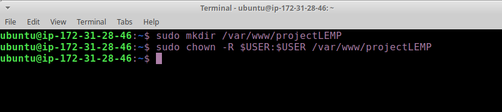

# STEP 4 — CONFIGURING NGINX TO USE PHP PROCESSOR

- When using the Nginx web server, we can create server blocks (similar to virtual hosts in Apache) to encapsulate configuration details and host more than one domain on a single server. In this guide, we will use projectLEMP as an example domain name.

On Ubuntu 20.04, Nginx has one server block enabled by default and is configured to serve documents out of a directory at /var/www/html. While this works well for a single site, it can become difficult to manage if you are hosting multiple sites. Instead of modifying /var/www/html, we’ll create a directory structure within /var/www for the your_domain website, leaving /var/www/html in place as the default directory to be served if a client request does not match any other sites.

1. Create the root web directory for your_domain as follows:
`sudo mkdir /var/www/projectLEMP`

2. Next, assign ownership of the directory with the $USER environment variable, which will reference your current system user:
run `sudo chown -R $USER:$USER /var/www/projectLEMP`

3. Then, open a new configuration file in Nginx’s sites-available directory using your preferred command-line editor. Here, we’ll use nano:
run `sudo nano /etc/nginx/sites-available/projectLEMP`

4. This will create a new blank file. Paste in the following bare-bones configuration:

Add the config below to the editor

server {
    listen 80;
    server_name projectLEMP www.projectLEMP;
    root /var/www/projectLEMP;

    index index.html index.htm index.php;

    location / {
        try_files $uri $uri/ =404;
    }

    location ~ \.php$ {
        include snippets/fastcgi-php.conf;
        fastcgi_pass unix:/var/run/php/php7.4-fpm.sock;
     }

    location ~ /\.ht {
        deny all;
    }

}

When you’re done editing, save and close the file. If you’re using nano, you can do so by typing CTRL+X and then y and ENTER to confirm.

5. Activate your configuration by linking to the config file from Nginx’s sites-enabled directory:
run `sudo ln -s /etc/nginx/sites-available/projectLEMP /etc/nginx/sites-enabled/`

6. This command above will tell Nginx to use the configuration next time it is reloaded. You can test your configuration for syntax errors by typing: `sudo nginx -t`
You should see something like the image below. 
If any errors are reported, go back to your configuration file to review its contents before continuing.

7. We also need to disable default Nginx host that is currently configured to listen on port 80, for this run: `sudo unlink /etc/nginx/sites-enabled/default`

8. Next, reload Nginx to apply the changes: by running `sudo systemctl reload nginx`

9. Your new website is now active, but the web root /var/www/projectLEMP is still empty. Create an index.html file in that location so that we can test that your new server block works as expected:
run `sudo echo 'Hello LEMP from hostname' $(curl -s http://169.254.169.254/latest/meta-data/public-hostname) 'with public IP' $(curl -s http://169.254.169.254/latest/meta-data/public-ipv4) > /var/www/projectLEMP/index.html`

10. Now go to your browser and try to open your website URL using IP address:

11. If you see the text from ‘echo’ command you wrote to index.html file, then it means your Nginx site is working as expected.
In the output you will see your server’s public hostname (DNS name) and public IP address. You can also access your website in your browser by public DNS name, not only by IP – try it out, the result must be the same (port is optional)

- You can leave this file in place as a temporary landing page for your application until you set up an index.php file to replace it. Once you do that, remember to remove or rename the index.html file from your document root, as it would take precedence over an index.php file by default.

Your LEMP stack is now fully configured. In the next step, we’ll create a PHP script to test that Nginx is in fact able to handle .php files within your newly configured website.
