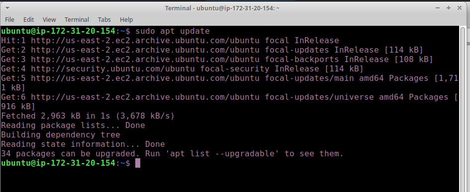
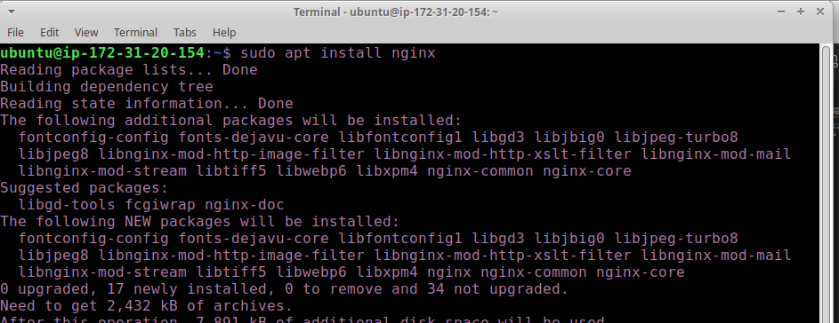
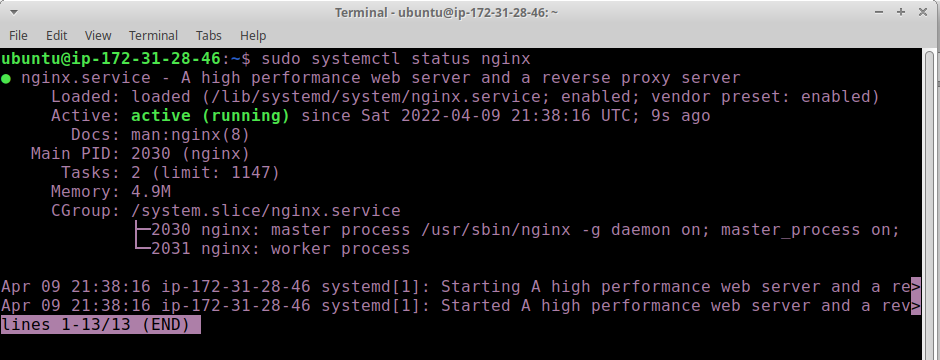
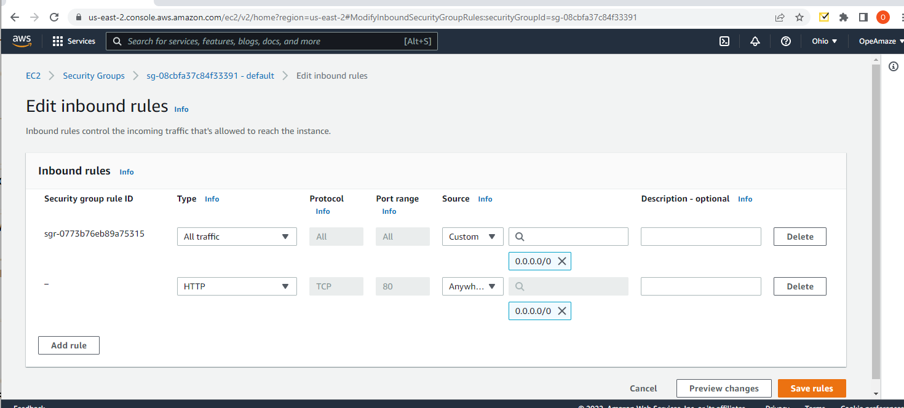
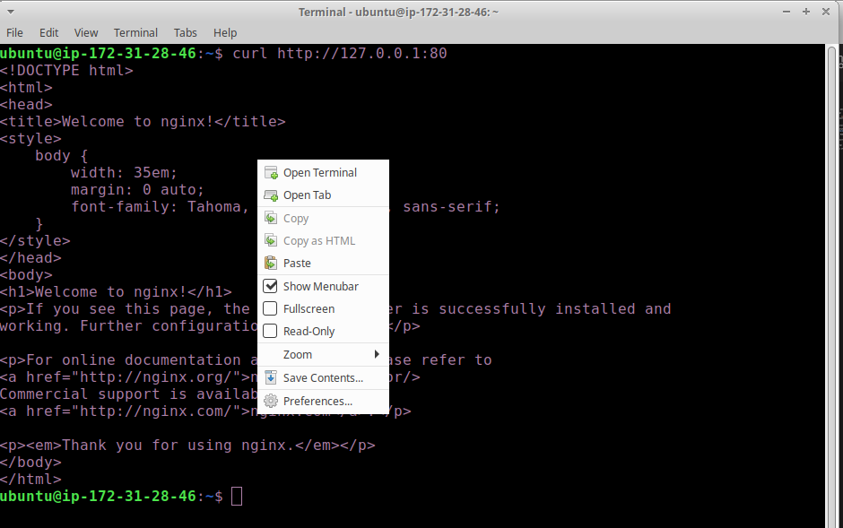
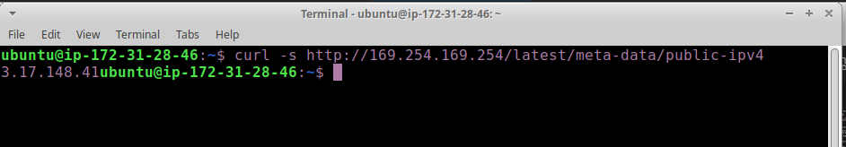
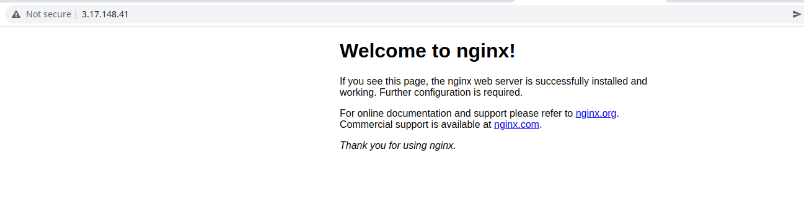

# STEP 1 – INSTALLING THE NGINX WEB SERVER

1. Let us start of by updating our server's package index by running the command `sudo apt update`

2. Now install the nginx package by running `sudo apt install nginx`
When prompted, enter Y to confirm that you want to install Nginx. Once the installation is finished, the Nginx web server will be active and running on your Ubuntu 20.04 server.

3. To verify that nginx was successfully installed and is running as a service in Ubuntu, run: `sudo systemctl status nginx`

If it is green and running, then you did everything correctly – you have just launched your Web Server in the Clouds!

4. Before we can receive any traffic by our Web Server, we need to open TCP port 80 which is default port that web brousers use to access web pages in the Internet.

As we know, we have TCP port 22 open by default on our EC2 machine to access it via SSH, so we need to add a rule to EC2 configuration to open inbound connection through port 80:

5. Let us try to access it locally using any of the following commands

`curl http://localhost:80`
or
`curl http://127.0.0.1:80`

6. Now it is time for us to test how our Nginx server can respond to requests from the Internet.
Open a web browser of your choice and try to access following url. 

`http://<Public-IP-Address>:80`

to get the public ip, use command `curl -s http://169.254.169.254/latest/meta-data/public-ipv4` or get it from the aws console

then run input it into your browser

If you see the page above, then your web server is now correctly installed and accessible through your firewall.