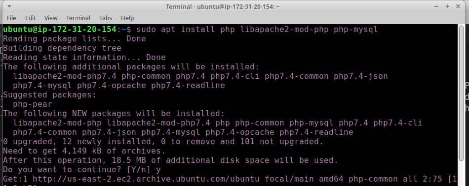
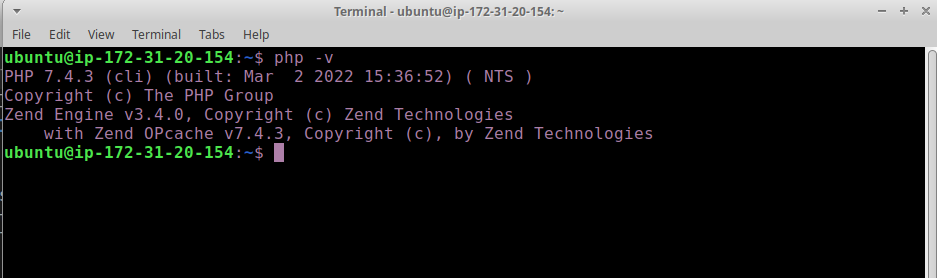

# STEP 3 — INSTALLING PHP

1. You have Apache installed to serve your content and MySQL installed to store and manage your data. PHP is the component of our setup that will process code to display dynamic content to the end user. In addition to the php package, you’ll need php-mysql, a PHP module that allows PHP to communicate with MySQL-based databases. You’ll also need libapache2-mod-php to enable Apache to handle PHP files. Core PHP packages will automatically be installed as dependencies.

To install these 3 packages at once, run: `sudo apt install php libapache2-mod-php php-mysql`

respond with y/yes to the prompts

2. Once the installation is finished, you can run the following command to confirm your PHP version:

`php -v`

#### congrats you have php installed