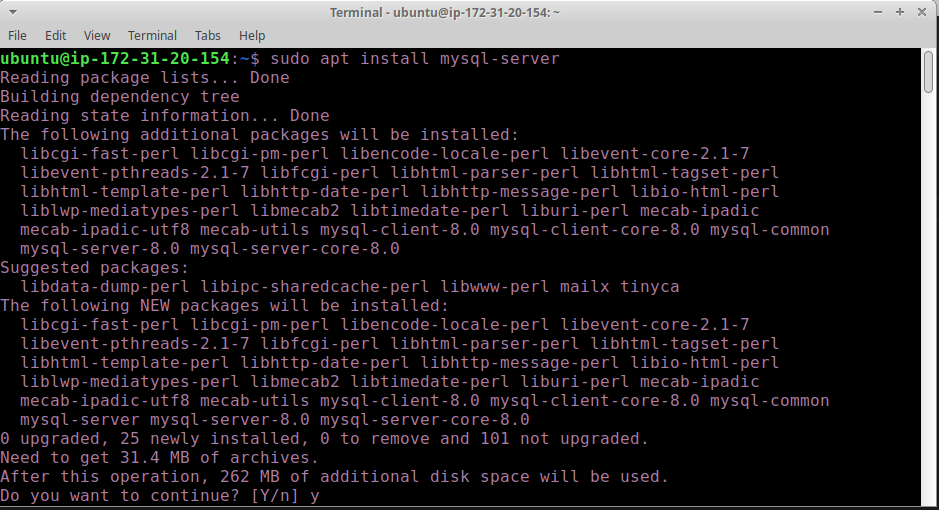
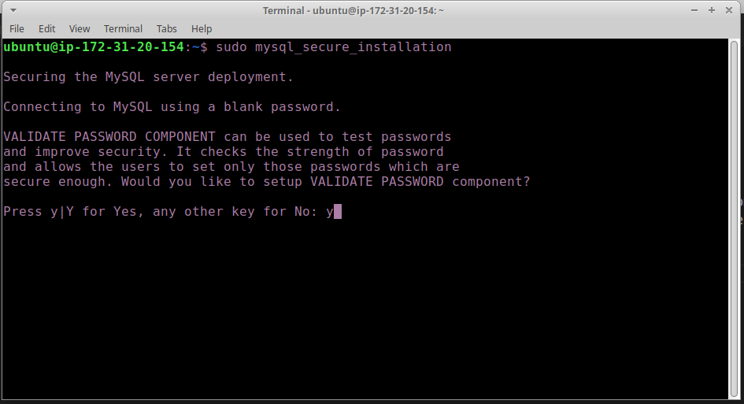
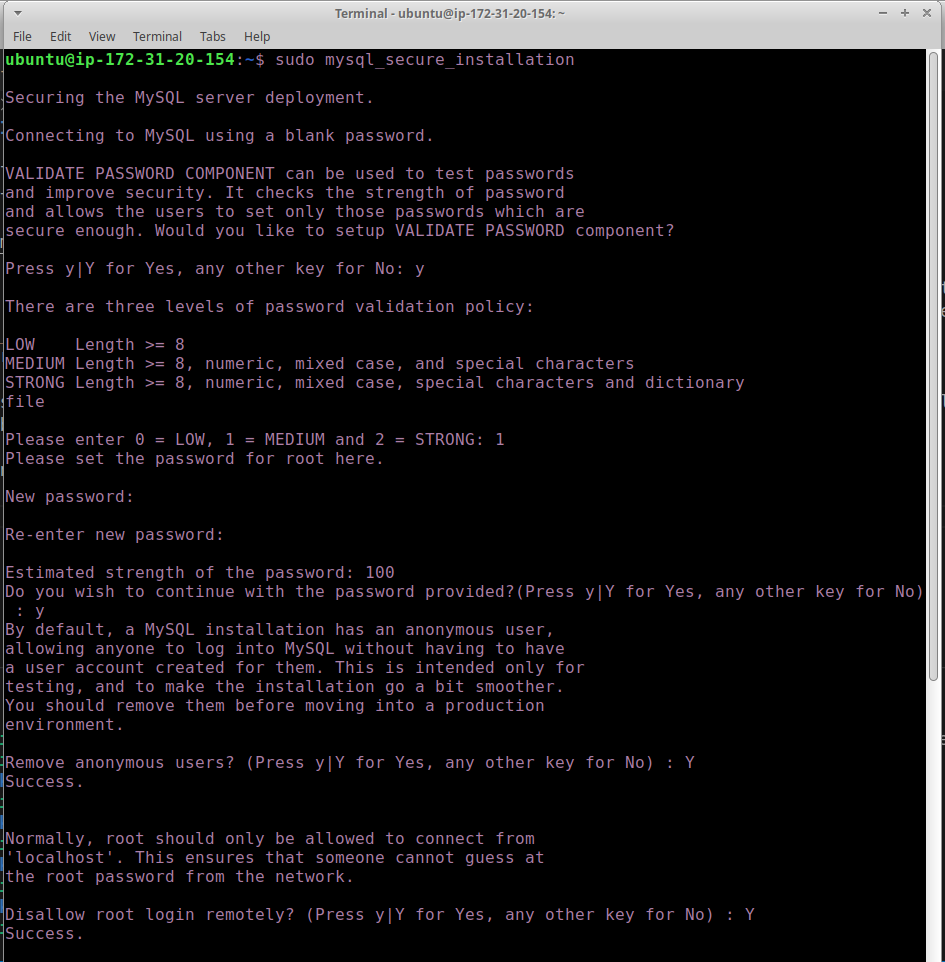
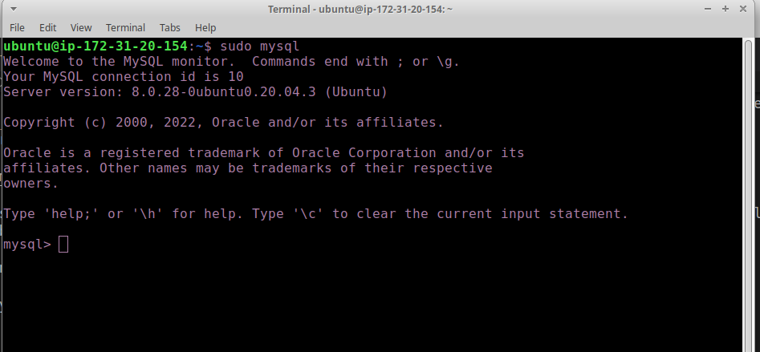
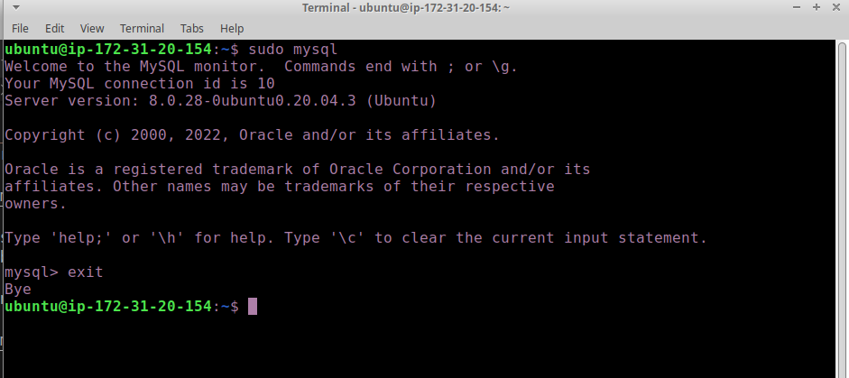

# STEP 2 — INSTALLING MYSQL

1. To install mysql run the following command `sudo apt install mysql-server`
 when prompted for a confirmation to continue type y/yes then enter

2. When the installation is finished, it’s recommended that you run a security script that comes pre-installed with MySQL. This script will remove some insecure default settings and lock down access to your database system. Start the interactive script by running:
`sudo mysql_secure_installation`
Answer Y for yes, or anything else to continue without enabling.

If you choose to Y/Yes and choose to input a password, note that when you are typing the password it will not show on the terminal so be careful to be sure of what you are typing.

Aftewards answer yes to all of the following prompts

3. Finally test if able to log in to the MySql server by running `sudo mysql`
Once everything is setup you should have something similar to the image below

4. To exit the MySQL console, type:
 `exit` into the Mysql terminal

 

#### Your MySQL server is now installed and secured. Next, we will install PHP, the final component in the LEMP stack.
