# STEP 6 – RETRIEVING DATA FROM MYSQL DATABASE WITH PHP (CONTINUED)

- In this step you will create a test database (DB) with simple "To do list" and configure access to it, so the Nginx website would be able to query data from the DB and display it.

At the time of this writing, the native MySQL PHP library mysqlnd doesn’t support caching_sha2_authentication, the default authentication method for MySQL 8. We’ll need to create a new user with the mysql_native_password authentication method in order to be able to connect to the MySQL database from PHP.

We will create a database named example_database and a user named example_user, but you can replace these names with different values.

1. First, connect to the MySQL console using the root account:
run `sudo mysql`

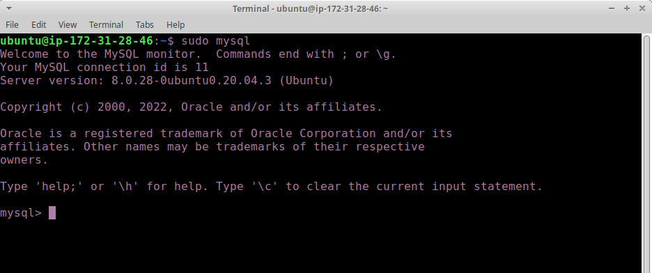

2. To create a new database, run the following command from your MySQL console:
CREATE DATABASE `example_database`;

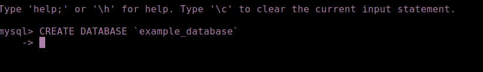

3. Now you can create a new user and grant him full privileges on the database you have just created.
- The following command creates a new user named example_user, using mysql_native_password as default authentication method. We’re defining this user’s password as password, but you should replace this value with a secure password of your own choosing.

`mysql>  CREATE USER 'example_user'@'%' IDENTIFIED WITH mysql_native_password BY 'password'`

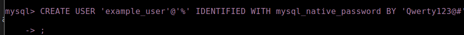

4. Now we need to give this user permission over the example_database database:

`mysql> GRANT ALL ON example_database.* TO 'example_user'@'%';`

This will give the example_user user full privileges over the example_database database, while preventing this user from creating or modifying other databases on your server.

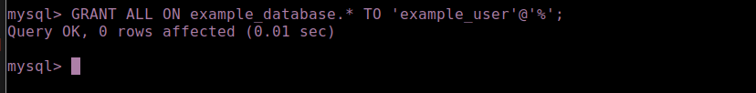

5. Now exit the MySQL shell with: `mysql> exit`
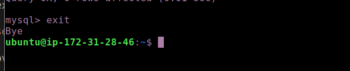

6. Test if the new user has the proper permissions by logging in to the MySQL console again, this time using the custom user credentials:
`mysql -u example_user -p`

Notice the -p flag in this command, which will prompt you for the password used when creating the example_user user. 

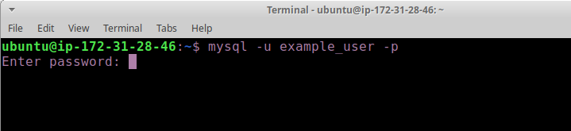

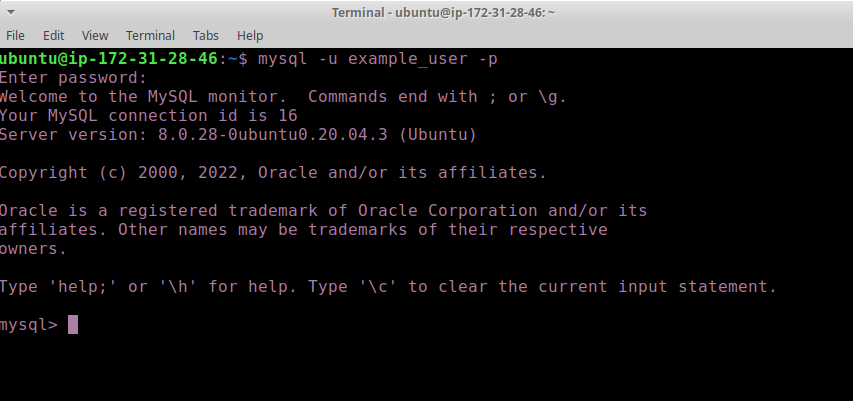

7. After logging in to the MySQL console, confirm that you have access to the example_database database
run `mysql> SHOW DATABASES;`

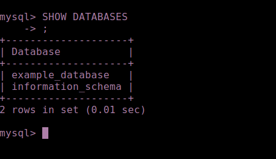

8. Next, we’ll create a test table named todo_list. From the MySQL console, run the following statement:

CREATE TABLE example_database.todo_list (
mysql>     item_id INT AUTO_INCREMENT,
mysql>     content VARCHAR(255),
mysql>     PRIMARY KEY(item_id)
mysql> );

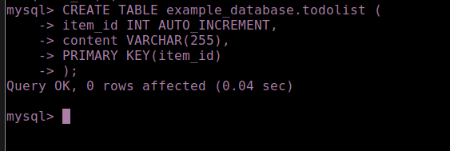

9. Insert a few rows of content in the test table. You might want to repeat the next command a few times, using different VALUES:
`mysql> INSERT INTO example_database.todo_list (content) VALUES ("My first important item");`

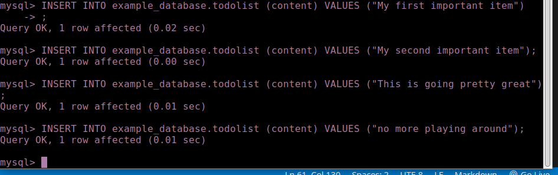

10. To confirm that the data was successfully saved to your table, run:
`mysql>  SELECT * FROM example_database.todo_list;`

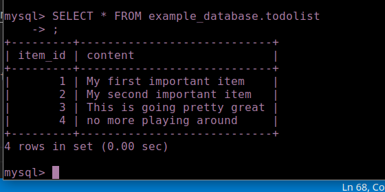

11. After confirming that you have valid data in your test table, you can exit the MySQL console:
`mysql> exit`

12. Now you can create a PHP script that will connect to MySQL and query for your content. Create a new PHP file in your custom web root directory using your preferred editor. We’ll use vi for that:
`nano /var/www/projectLEMP/todo_list.php`

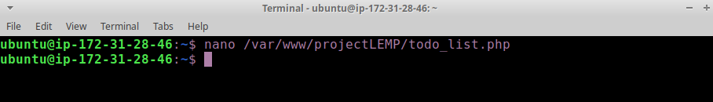

13. The following PHP script connects to the MySQL database and queries for the content of the todo_list table, displays the results in a list. If there is a problem with the database connection, it will throw an exception.

- Copy this content into your todo_list.php script:

<?php
$user = "example_user";
$password = "password";
$database = "example_database";
$table = "todo_list";

try {
  $db = new PDO("mysql:host=localhost;dbname=$database", $user, $password);
  echo "<h2>TODO</h2><ol>";
  foreach($db->query("SELECT content FROM $table") as $row) {
    echo "<li>" . $row['content'] . "</li>";
  }
  echo "</ol>";
} catch (PDOException $e) {
    print "Error!: " . $e->getMessage() . " ";
    die();
}

Save and close the file when you are done editing.

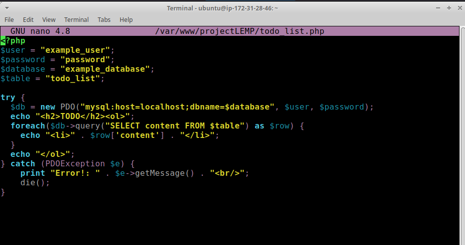

14. You can now access this page in your web browser by visiting the domain name or public IP address configured for your website, followed by /todo_list.php:

`http://<Public_domain_or_IP>/todo_list.php`

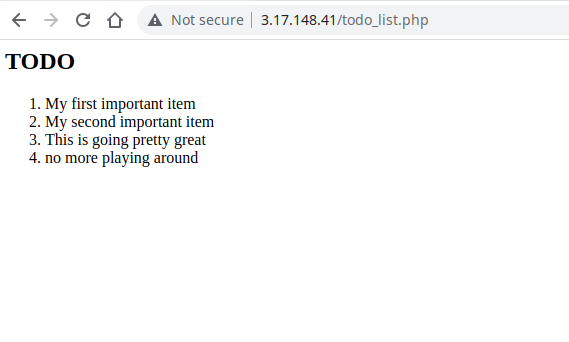

#### That means your PHP environment is ready to connect and interact with your MySQL server.

## Congratulations!

### In this guide, we have built a flexible foundation for serving PHP websites and applications to your visitors, using Nginx as web server and MySQL as database management system.
