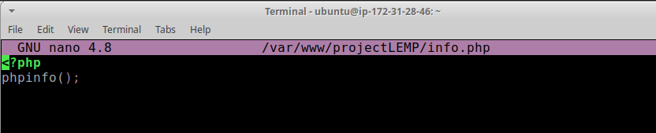
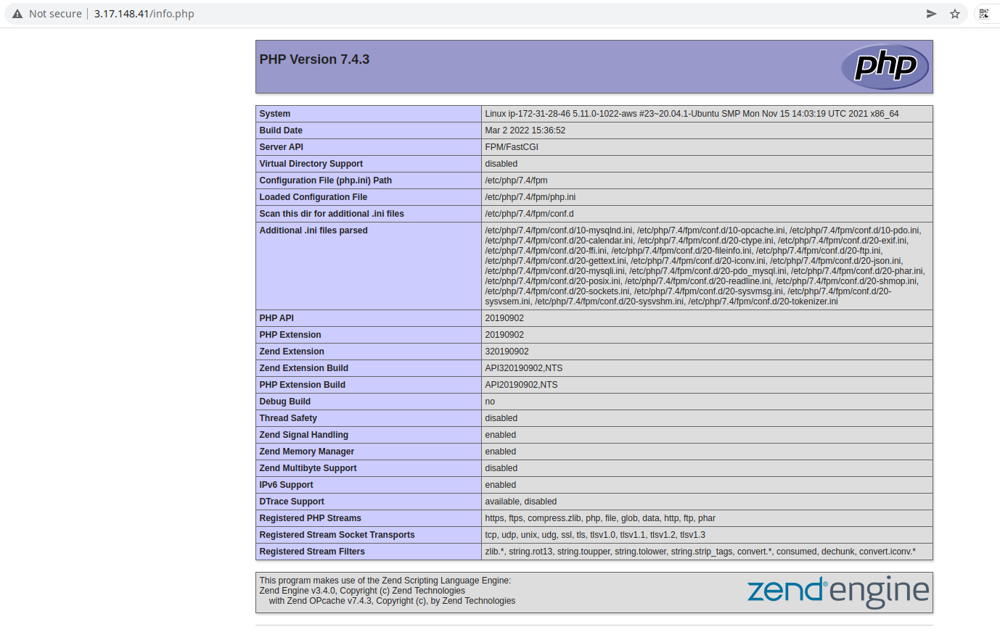
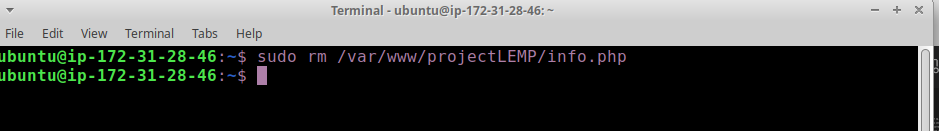

# STEP 5 – TESTING PHP WITH NGINX

Your LEMP stack should now be completely set up.

At this point, your LAMP stack is completely installed and fully operational.

You can test it to validate that Nginx can correctly hand .php files off to your PHP processor.

1. You can do this by creating a test PHP file in your document root. Open a new file called info.php within your document root in your text editor: run `sudo nano /var/www/projectLEMP/info.php`

2. Type or paste the following lines into the new file. This is valid PHP code that will return information about your server:

<?php
phpinfo();

3. You can now access this page in your web browser by visiting the domain name or public IP address you’ve set up in your Nginx configuration file, followed by /info.php: In this case it will be `http://3.17.148.41/info.php`

4. After checking the relevant information about your PHP server through that page, it’s best to remove the file you created as it contains sensitive information about your PHP environment and your Ubuntu server. You can use rm to remove that file:
`sudo rm /var/www/your_domain/info.php`

